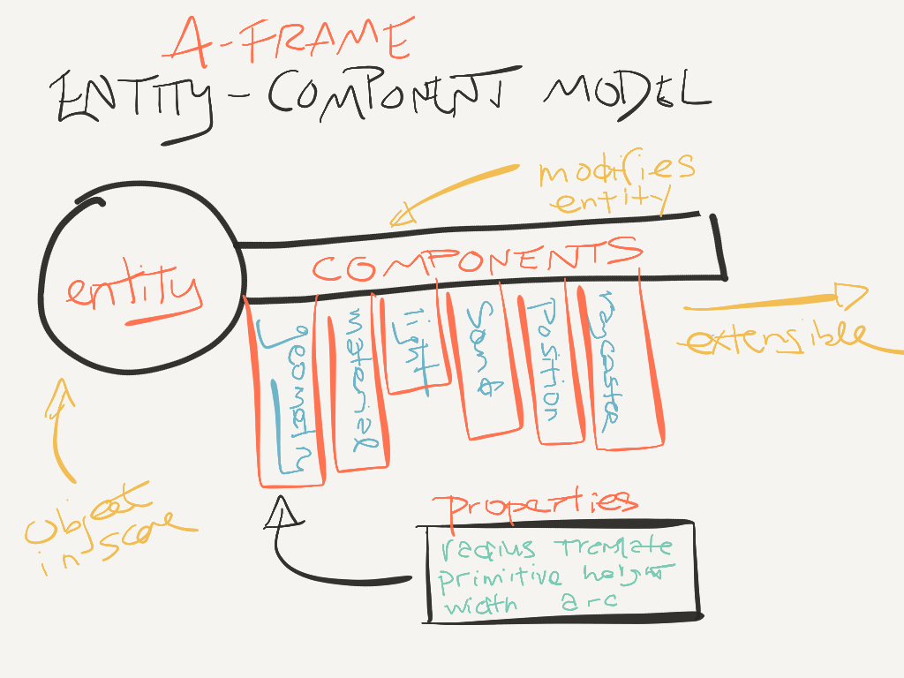
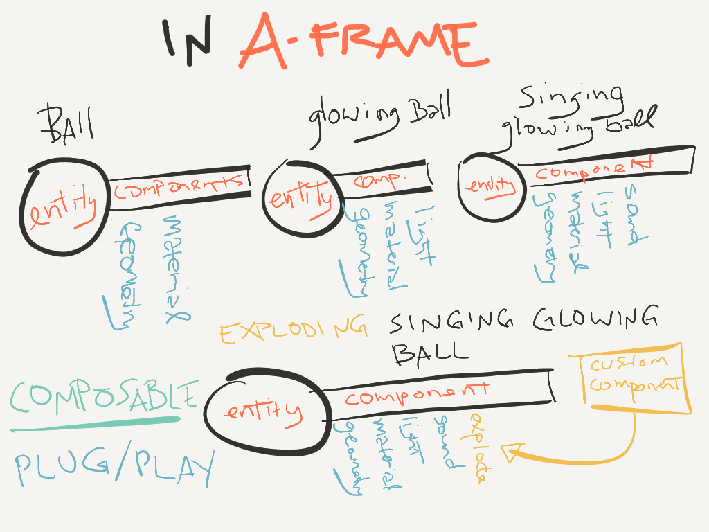

<!-- .slide: data-background="media/img/aframe.jpg" -->

<div class="talk-title">
  <h1>Web Based Virtual Reality</h1>
  <p class="talk-info" align="center">
@shaguftamethwan | Shagufta | Mozilla TechSpeaker
  </p>
</div>

<!-- NOTES -->
Good afternoon everyone.
So, let us have a count of hands, how many of you are web developers or have ever used HTML JS CSS? Okay great. And how many of you have built or can build virtual reality applications? Great. So let’s try and make the count of the two groups equal by the end of the session!
A little about me, I’m Shagufta. I’m from Pune, India. I have been contributing to Mozilla for a few years and started working on A-Frame some time back (and have been loving it). I’m a techspeaker for Mozilla and one of the Representatives in India. Other than that, I work as a software developer at HSBC.


------

# Virtual Reality

<!-- .slide: data-background-video="media/video/virtualreality.mp4" data-background-video-loop="true" data-background-video-muted="true" data-state="state--bg-dark" -->

<!-- NOTES -->
- Ask who can tell abput VR and how many have tried VR.
- Going by the definition, VR is the computer-generated simulation of a 3d image or environment that can be interacted with in a seemingly real or physical way by a person using special electronic equipment, such as a headset. SO basically, a technology platform that transports you to realistic, interactive, immersive 3D environments. 
- It's the next platform, it will change how we work + play + communicate digitally. You can see in the background people doing a lot of cool things. But they need a headset for doing that
---

<div class="image-row">
  <div></div>
  <div></div>
  <div></div>
</div>

<div class="image-row">
  <div></div>
  <div></div>
  <div></div>
</div>

<!-- NOTES -->
- There are different kinds of headsets in the market. All of them differ in complexity and the way they function. There is google cardboard which costs around 5 dollars and uses the gyroscope from your phone for motion sensing, low FPS, it’s a mobile VR headset, very low quality. and there is HTC Vive which is around 800 dollars and has base stations, sensors, rotational and positional tracking both, complete room scale tracking. It has 2 controllers, Great FOV and FPS. And needs to be tethered to a PC with a very high processing power. That said, the worlds/experiences created by it are absolutely mesmerizing


---

## Friction of VR Ecosystems

<div class="captioned-image-row">
  <div>
    
    <i>Gatekeepers</i>
  </div>
  <div>
    
    <i>Installs</i>
  </div>
  <div>
    
    <i>Closed</i>
  </div>
</div>

<!-- NOTES -->
- But the problem for developers is, that there is a lot of “friction” in the VR ecosystem. There are gatekeepers… you cannot just publish and share your development with the world, hey I built this, wanna check it out?,,,, nope. You will have to go through a lot of approvals by the “gatekeepers”, you will have to fit their criteria, App stores and corporations control distribution: they can take down or block content …you will have to then make other people download the app. And it’s a closed blackbox for that person, they don’t know whats happening inside. Speaking of downloads, you yourself will have to install a lot of big softwares with complex setups for the development itself, and maybe learn a new language too, and then spend time to make it work with multiple headsets. . And as I said, it’s a Closed ecosystem: proprietary engines, steep learning curves, siloed experiences and fragmentation.. 
- We want VR to be successful, so we want a platform without these points of friction. And The answer is …
------

# WebVR

An open virtual reality platform with the advantages of **the Web**

<div class="captioned-image-row">
  <div>
    
    <i>Open</i>
  </div>
  <div>
    
    <i>Connected</i>
  </div>
  <div>
    
    <i>Instant</i>
  </div>
</div>

<!-- NOTES -->
- WebVR!
- WebVr enables web developers to build fantastic cross platform, cross device VR experiences. 
- So, quoting from a talk in google io, VR should be accessible to everyone because it has the potential to let everyone explore, play and create in amazing new ways. Developers should be able to make something quickly and share it with everyone, no matter what device they're on. Kind of how easy it is to share stuff on the web, but with VR. And that's the very idea behind WebVR. It's VR, on the web, for everyone. Developers can develop VR experiences just how they develop their regular websites, with web technologies.
- And It has all advantages of the web. open, anyone can publish, open source with open standards. Connected, you can traverse worlds and scenes just like hyperlinks in the 2d web, and instant, click a link and bam you’re there! No installs at all!

---


Browser APIs that enable WebGL rendering to headsets and access to VR
sensors

https://w3c.github.io/webvr/

<!-- NOTES -->
It’s basically a javascript api for the browser that enables WebGL rendering to headsets and access to VR sensors. The Initial WebVR API was by Mozilla, now there is a Working W3C community group. Mozilla, Google, Samsung, Microsoft, they are currently implementing WebVR API for their browsers

---

https://webvr.rocks

<div class="captioned-image-row small">
  <div>
    
    <i>Firefox Nightly</i>
  </div>
  <div>
    
    <i>Microsoft Edge</i>
  </div>
  <div>
    
    <i>Chromium</i>
  </div>
</div>

<div class="captioned-image-row small">
  <div>
    
    <i>Chrome for Android</i>
  </div>
  <div>
    
    <i>Oculus Carmel</i>
  </div>
  <div>
    
    <i>Samsung Internet</i>
  </div>
  <div>
    
    <i>Mobile Polyfill</i>
  </div>
</div>

<!-- NOTES -->
These, are the browsers that support it, and Mobile Polyfill uses the device motion or orientation sensors to polyfill on smartphones.

---

## Metaverse

<!-- .slide: data-background="media/img/metaverse.jpg" -->

<!-- NOTES -->
- The concept of Metaverse is, Shared persistent collective virtual spaces. An Alternate digital reality that the world may live, work, play in.. 
- it Must be decentralized/open/connected, and the Web is best platform to fully realize that. But…Where do we begin?
- three.js , the library currently used for WebVR, abstracts WebGL, 3D, and WebVR very well, but could we still make it more accessible?

---

Too hard to create WebVR experiences...

---

<!-- .slide: data-background-video="media/video/boilerplate.mp4" data-state="state--bg-dark" -->

<div class="slide__boilerplate">
  <p>Import WebVR polyfill</p>
  <p>Set up camera</p>
  <p>Set up lights</p>
  <p>Initialize scene</p>
  <p>Declare and pass canvas</p>
  <p>Listen to window resize</p>
  <p>Install VREffect</p>
  <p>Instantiate renderer</p>
  <p>Create render loop</p>
  <p>Preload assets</p>
  <p>Figure out responsiveness</p>
  <p>Deal with metatags and mobile</p>
</div>

<!-- NOTES -->
- You need to import the webvr polyfill, setup lights camera, (not action), the render loop, responsiveness, etc all these things! 
- It’s a Huge obstacle if you’re doing small prototypes and experiments. You need a lot of lines of code for the setup itself, which is something that isn’t what you might wanna do, right? 
- The Boilerplate code needs updating with new versions of WebVR, three.js, and browser quirks.
- What if, we could encapsulate all of this, into one line?! 

------

# A-Frame

<!-- .slide: data-background="media/img/aframe-rendered-full.png" -->

A web framework for building virtual reality experiences

<!-- NOTES -->
- Well, introducing A-Frame!!\
- A-Frame is an open source web framework for building virtual reality experiences. It’s built on top of three.js, It makes it Easy for web developers to create VR content, without graphics knowledge,  you can Prototype and experiment WebVR and VR UX faster, it’s a vehicle to kickstart the WebVR ecosystem! 
- The best part is, you can write most of the applications, atleast the simple ones, using just simple plain HTML!. How cool is that! All of us have probably already studied HTML in school days ,and even if we haven’t, how much time does it take? A few hours? That’s it? Doesn’t it sound super easy? And you get unlimited access to all that goes behind WebVR. 
- For advanced applications you might need to write components and logic in javascript, but that’s about it! 

---

## Hello World

<!-- .slide: data-background="media/img/aframe.jpg" data-transition="slide-in none" -->

```html
<html>
  <script src="https://aframe.io/releases/0.5.0/aframe.min.js"></script>
  <a-scene>


  </a-scene>
</html>
```
<!-- .element: class="stretch" -->

<!-- NOTES -->
- So, lets check out a “hello world” application for a-frame.
- Now remember how I told u about encapsulating all of the boilerplate code in one line, well, “a-scene” is the global object in a-frame responsible for that, it does all of it for you, canvas, camera, renderer, lights, controls, render loop, WebVR polyfill, VREffect, without any effort, and without any extra lines of code, all you have to do is write the tag, and then u can concentrate on the REAL stuff that you wanna build! 
- And also, you just need to drop a script tag, there are no build steps.
- Now lets put stuff inside our scene.

---

## Hello World

<!-- .slide: data-background="media/img/aframe.jpg" data-transition="fade-in slide-out" -->

```html
<html>
  <script src="https://aframe.io/releases/0.5.0/aframe.min.js"></script>
  <a-scene>
    <a-box color="#4CC3D9" position="-1 0.5 -3" rotation="0 45 0"></a-box>
    <a-cylinder color="#FFC65D" position="1 0.75 -3" radius="0.5" height="1.5"></a-cylinder>
    <a-sphere color="#EF2D5E" position="0 1.25 -5" radius="1.25"></a-sphere>
    <a-plane color="#7BC8A4" position="0 0 -4" rotation="-90 0 0" width="4" height="4"></a-plane>
    <a-sky color="#ECECEC"></a-sky>
  </a-scene>
</html>
```
<!-- .element: class="stretch" -->

<!-- NOTES -->
- I have added a-box , a-cylinder, a-sphere, a-plane, all these are the primitive elements provided by a-frame for building a box, cylinder sphere.and plane. We can specify components in a-frame just like css tags, here I have mentioned the rotation, position on x,y, z axis, and other related parameters. A-sky is the..well..sky! The surrounding world. You can have a colored one, or maybe a 360 degre image or video too, for that. 
- Just look at this, it is so readable, HTML is arguably most accessible language in computing! It is Encapsulated, you copy-and-paste the HTML anywhere else and it will still work, no state or variables,. Lets see what this produced.


---
<!-- .slide: data-background="media/img/aframe.jpg" -->

<div class="stretch" data-aframe-scene="scenes/hello-world.html"></div>

<!-- NOTES -->
So with 5 lines of code, you will have already built your first VR applicaton! WOW! We can just put the headsets on and check this out..

---

## Hello Metaverse

<i>by Ada Rose Edwards (@lady_ada_king)</i>

<!-- .slide: data-background="media/img/metaverse.jpg" -->

<div class="stretch" data-aframe-scene="scenes/80s.html"></div>

<!-- NOTES -->
- So, we’re already one-step closer to the metaverse we talked about!
- This is an a-frame scene embedded in my html slides btw. You can just open up the DOM inspector to change the values too!


---

<!-- .slide: data-background="media/img/aframe.jpg" -->

## Works With Everything

<div class="captioned-image-row">
  <div>
    
    <i>d3.js</i>
  </div>
  <div>
    
    <i>Vue.js</i>
  </div>
  <div>
    
    <i>React</i>
  </div>
  <div>
    
    <i>Redux</i>
  </div>
  <div>
    
    <i>jQuery</i>
  </div>
  <div>
    
    <i>Angular</i>
  </div>
</div>

<!-- NOTES -->

- Now since it is based on HTML, it is compatible with all your favorite existing libraries and frameworks. This is a really good reason to have HTML as an intermediary layer between WebGL/three.js, and Under the hood, A-Frame is an extensible, declarative framework for three.js. 
------

# Entity-Component-System

<!-- .slide: data-background="media/img/minecraft-blocks.png" -->

<!-- NOTES -->
- A-Frame is a three.js framework with an entity-component-system (ECS) architecture. ECS architecture is a common and desirable pattern in 3D and game development, especially popular in Unity. It follows the composition over inheritance and hierarchy principle.
- All objects in a scene are entities that are inherently empty objects. You can plug in components to attach appearance / behavior / functionality.
- On the 2D Web, we lay out elements that have fixed behavior in a hierarchy. 3D/VR is different, objects can be of infinite types and complexities, and there is a need of an easy way to build up different kinds of objects.
- It allows for a greater flexibility when defining objects by mixing and matching reusable parts. And it eliminates the problems of long inheritance chains with complex interwoven functionality. It promotes clean design via decoupling, encapsulation, modularization, reusability. 

---

<!-- .slide: data-background="media/img/minecraft-blocks.png" -->


<!-- NOTES -->

So in this image as we can see, there is an entity which is the container object into which components can be attached. It is the base of all objects in the scene. Without components, it won’t render anything, similar to empty <div>s.
Components are the reusable modules or data containers that can be attached to entities to provide appearance, behavior, and/or functionality. For ex the geometry, material, light etc. These are like plug-and-play for objects. All logic is implemented through them, and we define different types of objects by mixing, matching, and configuring components. Like alchemy! 

---

<!-- .slide: data-background="media/img/minecraft-blocks.png" -->


---

<!-- .slide: data-background="media/img/minecraft-blocks.png" data-transition="slide-in none" -->

## Composing an Entity

```html
<a-entity>
```
<!-- .element: class="stretch" -->

<!-- NOTES -->
- For creating an entity, we start with an <a-entity>. As I said, by itself, it has no appearance, behavior, functionality. We can plug in components to add appearance, behavior, functionality.

---

## Composing an Entity

<!-- .slide: data-background="media/img/minecraft-blocks.png" data-transition="none" -->

```html
<a-entity
  geometry="primitive: sphere; radius: 1.5"
  material="color: #343434; roughness: 0.4; sphericalEnvMap: #texture">
```
<!-- .element: class="stretch" -->

<!-- NOTES -->
- The syntax is similar to CSS styles. The component names are as HTML attributes. Component properties and values as are as HTML attribute’s values. 
---

## Composing an Entity

<!-- .slide: data-background="media/img/minecraft-blocks.png" data-transition="none" -->

```html
<a-entity
  geometry="primitive: sphere; radius: 1.5"
  material="color: #343434; roughness: 0.4; sphericalEnvMap: #texture"
  position="-1 2 4" rotation="45 0 90" scale="2 2 2">
```
<!-- .element: class="stretch" -->

---

## Composing an Entity

<!-- .slide: data-background="media/img/minecraft-blocks.png" data-transition="none" -->

```html
<a-entity
  geometry="primitive: sphere; radius: 1.5"
  material="color: #343434; roughness: 0.4; sphericalEnvMap: #texture"
  position="-1 2 4" rotation="45 0 90" scale="2 2 2"
  animation="property: rotation; loop: true; to: 0 360 0"
  movement-pattern="type: spline; speed: 4">
```
<!-- .element: class="stretch" -->

---

## Composing an Entity

<!-- .slide: data-background="media/img/minecraft-blocks.png" data-transition="none" -->

```html
<a-entity
  json-model="src: #robot"
  position="-1 2 4" rotation="45 0 90" scale="2 2 2"
  animation="property: rotation; loop: true; to: 0 360 0"
  movement-pattern="type: spline; speed: 4">
```
<!-- .element: class="stretch" -->

---

## Composing an Entity

<!-- .slide: data-background="media/img/minecraft-blocks.png" data-transition="none" -->

```html
<a-entity
  json-model="src: #robot"
  position="-1 2 4" rotation="45 0 90" scale="2 2 2"
  animation="property: rotation; loop: true; to: 0 360 0"
  movement-pattern="type: attack; target: #player"
  explode="on: hit">
```
<!-- .element: class="stretch" -->

---

<!-- .slide: data-background="media/img/standard-components.png" data-background-size="contain" -->

<!-- NOTES -->
- These are some components that ship with A-Frame out of the box. A-Frame is fully extensible at its core… And it has a huuuge community continuously contributing towards its improvement as well using the awesome stuff.

---

<!-- .slide: data-background="media/img/community-components.png" data-background-size="contain" -->

<!-- NOTES -->
- The community has filled the ecosystem with tons of components.  Components can do whatever they want, have full access to three.js and Web APIs. 
- The component ecosystem the lifeblood of A-Frame. Physics, leap motion, particle systems, audio visualizations, oceans. All you have to do is drop these components as script tags and use them straight from HTML. There are many advanced developers who are helping empower other developers.

---

# Registry

<!-- .slide: data-background-color="#333" -->

Curated collection of A-Frame components.

<a class="stretch" href="https://aframe.io/aframe-registry">
  <video loop data-src="media/video/registrypreview.mp4" data-autoplay></video>
</a>

<!-- NOTES -->
- The registry is a curated collection of A-Frame components. It’s like a store of components and people can browse and search for components or install them..
---

# Registry

<!-- .slide: data-background-color="#333" -->

Curated collection of A-Frame components.

<video loop data-src="media/video/leaphands.mp4" data-autoplay></video>

<!-- NOTES -->
For example, this leap-hand component, is built by one of the community members. And for a headset with controllers, all you need to do is include the component like this and you will have two ands with listeners for actions and whatever you wanna do with them! 

---

## Inspector

<!-- .slide: data-background="media/img/inspector.png" data-state="state--bg-dark" -->

Visual tool for A-Frame. Just `<ctrl>+<alt>+i`.

<div class="stretch" data-aframe-scene="scenes/80s.html"></div>

<!-- NOTES -->

A-Frame comes with a keyboard shortcut to inject the inspector. Just open up any A-Frame scene (running at least A-Frame v0.3.0) and press <ctrl> + <alt> + i to inject the inspector and you get a different view of the scene and can see the visual effect of tweaking entities. The VR analog to the browser’s DOM inspector. You can change properties of the components like the position… you can even add components.

------

JavaScript, Events, DOM APIs


<!-- NOTES -->

- And we can use JavaScript and DOM APIs to programmatically modify the scene and its entities. A-Frame is not just HTML; A-Frame provides access to JavaScript, DOM APIs, and three.js underneath for full control.
- To see JavaScript logs, we can open the browser's development console 

---

JavaScript, Events, DOM APIs

```
- var sceneEl = document.querySelector('a-scene');
- sceneEl.querySelectorAll('a-entity');
- sceneEl.querySelector('#box');
- sceneEl.querySelector('a-box').setAttribute('rotation', {x: 0, y: 0, z: 0});
- var boxEl = document.createElement('a-box'); boxEl.setAttribute('material', {color: '#EF2D5E'}); sceneEl.appendChild(boxEl);
- boxEl.addEventListener('foo', function () {
            boxEl.setAttribute('color', 'blue');  
          });
  boxEl.emit('foo');
```

<!-- NOTES -->
- This is javascript, right?!
- We can use document.querySelector() and document.querySelectorAll() to get a reference to the scene and its entities. We have  Entity.setAttribute() to modify entities after retrieving them,  document.createElement() to create entities, .setAttribute() to configure them, and .appendChild() to add them to the scene. Ex: In a JavaScript for loop, u can create and add 50 <a-box> elements with random positions and scales
- We can use .addEventListener() to register a handler function that will be called when an event is emitted. we can use event listeners to change the scene based on user input or other events.
- And there are a lot of..endless possibilities of what we can do !

------
## Add 3D Models

<!-- .slide: data-background-color="#333" -->

<div class="stretch" data-aframe-scene="scenes/gltf.html"></div>

<!-- NOTES -->

-Frame provides components for loading glTF, OBJ, COLLADA… Models come in the format of plain text files containing vertices, faces, UVs, textures, materials, and animations. They also come with images for textures, usually alongside the model file. three.js loaders parse these files to render them within a three.js scene as meshes. And A-Frame model components wrap these three.js loaders. So here in this scene, Seattle is the world, and we have this 3d model of the..queen!
---

<!-- .slide: data-background-color="#333" -->

<div class="stretch" data-aframe-scene="scenes/gltf.html"></div>

```html

  <a-entity obj-model="obj: #tree-obj; mtl: #tree-mtl" scale= "0.3 0.3 0.3" position="0 0 -3" rotation="0 0 0" ></a-entity>
  <a-sky src=#imgg ><a-sky>

```

------
<!-- .slide: data-background="media/img/aframe.jpg" -->

# Multi-user applications

---
Wait, to enable multi-users won't I have to know all about servers and complicated networking protocols?
---
<!-- .slide: data-background="media/img/giphy.gif" -->

<!-- NOTES -->

Well, not anymore! The Networked-Aframe component has you covered! It hides away a lot of the networking complexity, allowing you to write many multi-user VR apps entirely in HTML.
---
<!-- .slide: data-background-color="#333" -->
```
<html>
  <head>
    <script src="https://aframe.io/releases/0.5.0/aframe.min.js"></script>
    <script src="https://cdnjs.cloudflare.com/ajax/libs/socket.io/1.4.5/socket.io.min.js"></script>
    <script src="easyrtc/easyrtc.js"></script>
    <script src="https://unpkg.com/networked-aframe/dist/networked-aframe.min.js"></script>
  </head>
  <body>
    <a-scene></a-scene>
  </body>
</html>
```

<!-- NOTES -->

So, Lets build one from scratch! 
Before anything, you will need to have npm and install this networked-aframe module first.
Assuming you have set up your environment and the server runs, This is the template we'll begin with.
We;ve included all the dependencies; aframe, socket.io, EasyRTC and Networked-Aframe itself. And we have the basic a-scene tag that we already know about.
---
```
<a-scene networked-scene="
  app: myApp;
  room: room1;
  debug: true;
"></a-scene>
```

<!-- NOTES -->

First up we need to add the networked-scene component to the A-Frame a-scene tag.

Modify the <a-scene> tag like so:
---
## Create an Avatar
```
<a-assets>
  <script id="avatar-template" type="text/html">
    <a-entity class="avatar">
      <a-sphere class="head"
        color="#5985ff"
        scale="0.45 0.5 0.4"
      ></a-sphere>
      <a-entity class="face"
        position="0 0.05 0"
      >
        <a-sphere class="eye"
          color="#efefef"
          position="0.16 0.1 -0.35"
          scale="0.12 0.12 0.12"
        >
          <a-sphere class="pupil"
            color="#000"
            position="0 0 -1"
            scale="0.2 0.2 0.2"
          ></a-sphere>
        </a-sphere>
        <a-sphere class="eye"
          color="#efefef"
          position="-0.16 0.1 -0.35"
          scale="0.12 0.12 0.12"
        >
          <a-sphere class="pupil"
            color="#000"
            position="0 0 -1"
            scale="0.2 0.2 0.2"
          ></a-sphere>
        </a-sphere>
      </a-entity>
    </a-entity>
  </script>
</a-assets>

<a-entity id="player" networked="template:#avatar-template;showLocalTemplate:false;" camera position="0 1.3 0" wasd-controls look-controls></a-entity>
```
---
```
<script>
AFRAME.registerComponent('spawn-in-circle', {
  schema: {
    radius: {type: 'number', default: 1}
  },

  init: function() {
    var el = this.el;
    var center = el.getAttribute('position');

    var angleRad = this.getRandomAngleInRadians();
    var circlePoint = this.randomPointOnCircle(this.data.radius, angleRad);
    var worldPoint = {x: circlePoint.x + center.x, y: center.y, z: circlePoint.y + center.z};
    el.setAttribute('position', worldPoint);

    var angleDeg = angleRad * 180 / Math.PI;
    var angleToCenter = -1 * angleDeg + 90;
    var rotationStr = '0 ' + angleToCenter + ' 0';
    el.setAttribute('rotation', rotationStr);
  },

  getRandomAngleInRadians: function() {
    return Math.random()*Math.PI*2;
  },

  randomPointOnCircle: function (radius, angleRad) {
    x = Math.cos(angleRad)*radius;
    y = Math.sin(angleRad)*radius;
    return {x: x, y: y};
  }
});
</script>
```
---
```
<a-entity id="player" networked="template:#avatar-template;showLocalTemplate:false;" camera position="0 1.3 0" spawn-in-circle="radius:3;" wasd-controls look-controls></a-entity>
```
---
```
<!-- Add to bottom of the a-assets tag -->


<!-- Add to bottom of a-scene tag -->
<a-entity position="0 0 0"
  geometry="primitive: plane; width: 10000; height: 10000;" rotation="-90 0 0"
  material="src: #grid; repeat: 10000 10000; transparent: true; metalness:0.6; roughness: 0.4; sphericalEnvMap: #sky;"></a-entity>

<a-entity light="color: #ccccff; intensity: 1; type: ambient;" visible=""></a-entity>
<a-entity light="color: #ffaaff; intensity: 1.5" position="5 5 5"></a-entity>

<a-sky src="#sky" rotation="0 -90 0"></a-sky>
```
---
<!-- .slide: data-background="media/img/multi.gif" -->
------
<!-- .slide: data-background="media/img/header.png" -->

# Community

https://aframe.io/blog/

---

<!-- .slide: data-background="media/img/apainter.gif" -->

# Art - *A-Painter*

@mozillavr

---

<!-- .slide: data-background="media/img/syria.gif" -->

# Journalism - *Fear of the Sky*

Amnesty International UK

---

<!-- .slide: data-background="media/img/mars.jpg" -->

# Journalism - *Journey to Mars*

The Washington Post

---

<!-- .slide: data-background="media/img/citybuilder.gif" -->

# Sandbox - *City Builder*

@kfarr

---

<!-- .slide: data-background="media/img/adit.gif" -->

# Data Visualization - *Adit*

@datatitian

---

<!-- .slide: data-background="media/img/a-blast.gif" -->

# Gaming - *A-Blast*

@mozillavr

---

<!-- .slide: data-background="media/img/ux.gif" -->

# Prototyping - *UI Widgets*

@whoyee

---

<!-- .slide: data-background="media/img/math.gif" -->

# Mathematics - *MathworldVR*

@sleighdogs

---

<!-- .slide: data-background="media/img/ar.gif" -->

# AR - *AR.js + A-Frame*

@jerome_etienne

---

<!-- .slide: data-background="media/img/webvrstudio.png" -->

# Tools - *WebVR Studio*

@webvrstudio

---

<!-- .slide: data-background-video="media/video/livetour.mp4" data-background-video-loop="true" -->

# Real Estate - *Live Tour*

iStaging

---

<!-- .slide: data-background="media/img/cadavr.gif" -->

# Education - *CadaVR*

@drryanjames

---

# aframe.io

<div class="captioned-image-row">
  <div>
    
    <i>125 contributors 5000 Stargazers</i>
  </div>
  <div>
    
    <i>3000 members on Slack</i>
  </div>
  <div>
    
    <i>100s of featured projects</i>
  </div>
</div>

<!-- NOTES -->
- Open source and inclusive project
- Most work done on GitHub
- Active community on Slack to share projects, interact, hang out, seek help
- Featured projects on the `awesome-aframe` repository and *A Week of A-Frame* blog

---

<!-- .slide: data-background="media/img/js13k.jpg" -->

                                                                                                                                                                                                                                                                                                                                                                                                                                                                                                                       

